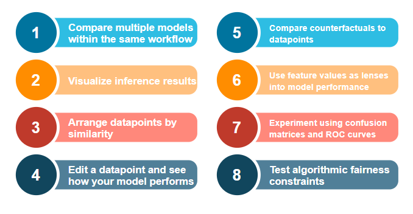
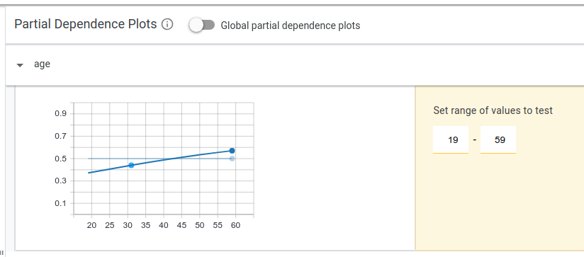
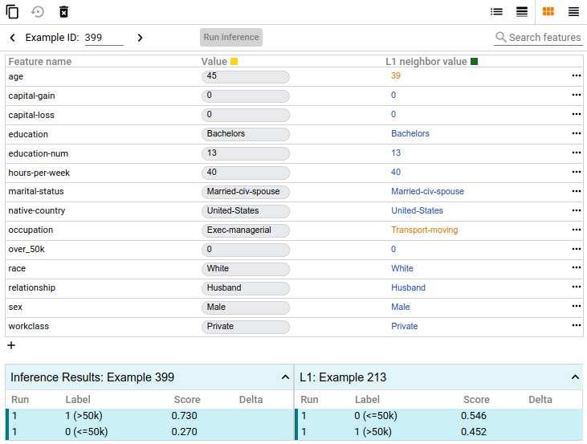

## **[Google What-if Tool](https://cloud.google.com/ai-platform/prediction/docs/using-what-if-tool#jupyter-notebook)**

**Description of the tool**

_What is its purpose?_

From Google’s[ introduction](https://pair-code.github.io/what-if-tool/):

The What-If Tool makes it easy to efficiently and intuitively explore up to two models' performance on a dataset. Investigate model performances for a range of features in your dataset, optimization strategies and even manipulations to individual datapoint values. All this and more, in a visual way that requires minimal code

_Who is the intended user?_

Used by developer but intended audience for the UI is broader: “whether you're a developer, a product manager, a researcher or a student. Now, everyone in your team can participate in probing, shaping and improving models.”

_What is its scope (algorithms, data, types of challenges)?_

-

Visualize feature importance for each model. The partial dependence plot (short PDP or PD plot) shows the marginal effect one or two features have on the predicted outcome of a machine learning model

- Counterfactual analysis: Arrange datapoints by similarity, automatically finds the “most similar” individual from the data set to compare the outcomes. Edit a datapoint and see how your model performs

- “Similarity” defined statistically (distance metric) but shouldn’t it be defined with input from a domain expert given it is a context-dependent metric

- Distance metric is L1 or L2 - using lasso or ridge regression. Both can be destabilized by collinearity / large feature set

1.

>>>>>  gd2md-html alert: inline image link here (to _media/image5.png). Store image on your image server and adjust path/filename/extension if necessary.  (<a href="#">Back to top</a>)(<a href="#gdcalert6">Next alert</a>) >>>>> 

Explore data distributions: can visually identify any skews in distributions, e.g. more men than women

IMAGE NEEDED

IMAGE NEEDED

-

Compare model performance (confusion matrix, scatterplot, histogram). Experiment using confusion matrices and ROC curves, apply various fairness metrics and thresholds

IMAGE NEEDED

IMAGE NEEDED

**Best for (Pros): **

What should practitioners use this tool for? Are there any scenarios / use cases in which this tool is particularly helpful vs. useless?

- Good for exploratory usage and finding counterfactual examples to visualize

What are the benefits of this tool?

- Easy to install and use, lots of useful documentation and demos

- Counterfactual analysis

**Cons &** **Limitations, especially any technical issues**

- Dependency on Google Cloud environment: requires customers to build and implement their models within the Google Cloud, not local servers / own environment. Potential security / legal issues?

- Doesn’t work with ensemble methods ([Source](https://insidebigdata.com/2020/03/01/the-pros-and-cons-of-googles-new-ai-transparency-tools/)): a version of the Aumann-Shapley method that uses a series of foils—called “counterfactuals”— models that weave together multiple models using diverse or competing techniques

- UI has too much information, difficult to know what to look at. While it says it requires no coding background, it would be challenging for anyone non-technical to navigate

- Not easily customizable to add new metrics or domain-specific reporting standards

- No consideration for what if the data set itself is biased - unrepresentative of the target population

- Out-of-the-box counterfactual / similarity metric potentially misleading.

  - Distance metric is L1 or L2 - using lasso or ridge regression. Both can be destabilized by collinearity / large feature set

  - Similarity is context-dependent

- No counterfactual explanation implementation, e.g. to say what needs to change to change the outcome

**Case study demo with screenshots**

Lots of demos[here](https://pair-code.github.io/what-if-tool/)
